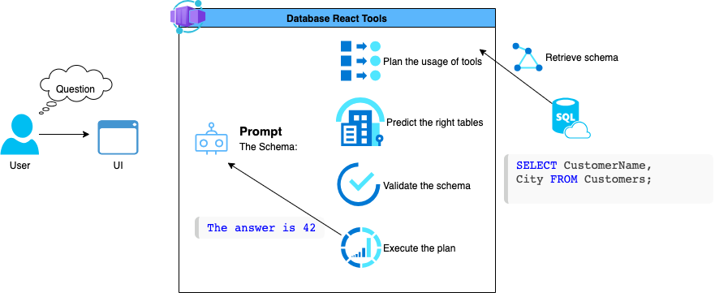
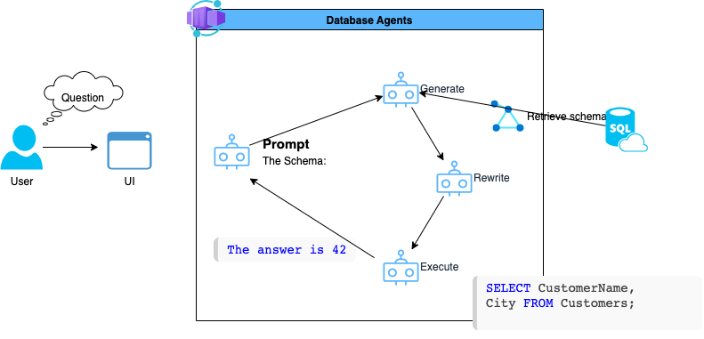

# Talking to a database with a large language model

This project demonstrates different approaches on how to implement a bot that can talk to a relational database.


## Implementation patterns

1.) Simple prompt


2.) ReAct based Prompt



3.) Multi agent



## Deploy Infrastructure

```
echo "log into azure dev cli - only once"
azd auth login

echo "provisioning all the resources with the azure dev cli"
azd up

echo "get and set the value for AZURE_ENV_NAME"
source <(azd env get-values | grep AZURE_ENV_NAME)

echo "building and deploying the streamlit user interface"
bash ./azd-hooks/deploy.sh sql-agents $AZURE_ENV_NAME
```

## Starting up


```
conda create -n sqlagents python=3.12

conda activate sqlagents

python -m pip install -r requirements.txt   

python -m streamlit run app.py --server.port=8000
```


## Startin up with open telemetry

```
docker run --rm --name jaeger \
  -e COLLECTOR_ZIPKIN_HOST_PORT=:9411 \
  -p 6831:6831/udp \
  -p 6832:6832/udp \
  -p 5778:5778 \
  -p 16686:16686 \
  -p 4317:4317 \
  -p 4318:4318 \
  -p 14250:14250 \
  -p 14268:14268 \
  -p 14269:14269 \
  -p 9411:9411 \
  jaegertracing/all-in-one:1.60

OTEL_EXPORTER_OTLP_ENDPOINT=http://localhost:4317

opentelemetry-instrument --service_name sql-ai-agent python -m streamlit run app.py --server.port=8000

open http://localhost:16686/search
```